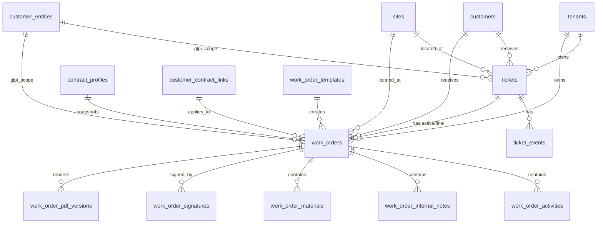
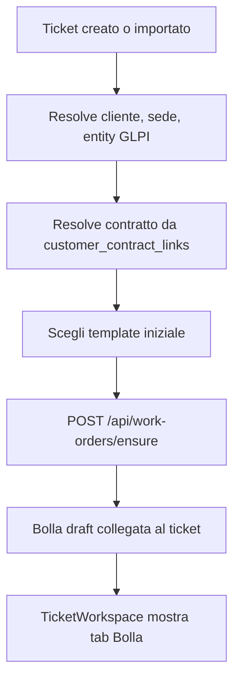
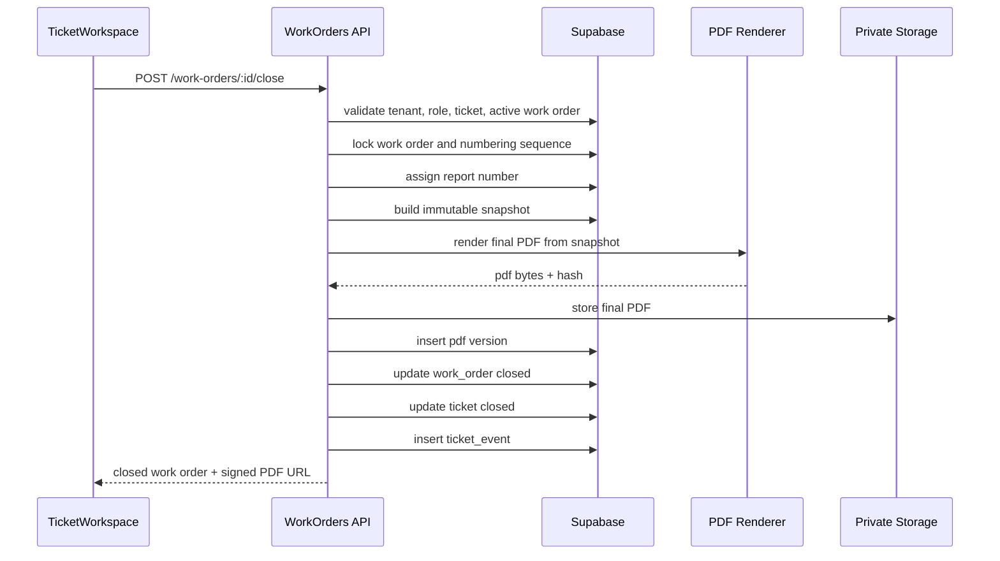
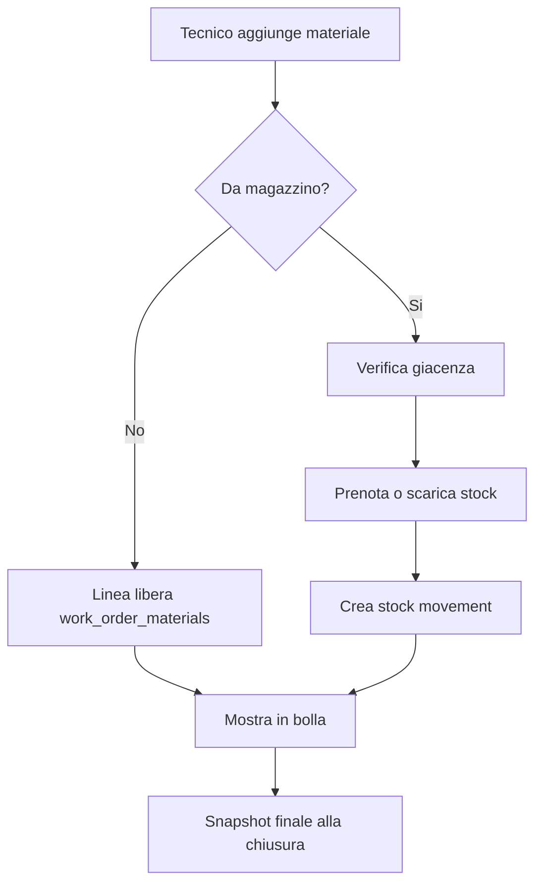
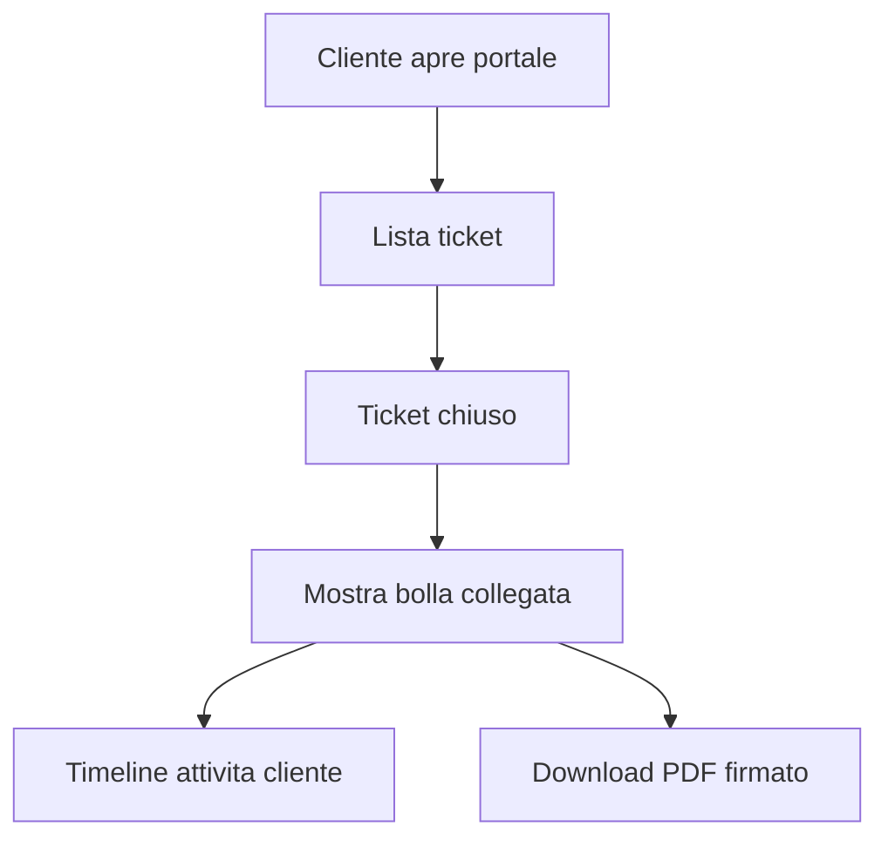

# Work Orders / Bolle - Enterprise Architecture Plan

Data: 2026-06-12

Questo documento e' un piano architetturale. Non modifica codice runtime e non modifica lo schema database attuale.

## 0. Contesto verificato

Fonti lette:

- `docs/work-orders-requirements.md`
- `docs/exemples/bolla chiusa test.pdf`
- `docs/exemples/bolla non chiusa test.pdf`
- `components/atlas/TicketWorkspace.tsx`
- superfici codice collegate a `tickets`, `ticket_events`, `contract_profiles`, `customer_contract_links`, `customer_entities`

Nota path: la richiesta cita `docs/examples`, ma nel repository i PDF sono in `docs/exemples`.

Stato attuale osservato:

- `TicketWorkspace` ha gia' tab operative: overview, conversazione, timeline, operativita, materiali, allegati, AI.
- Le attivita operative vengono oggi salvate come record in `ticket_events`.
- La chiusura ticket aggiorna direttamente `tickets.status`, `tickets.closed_at`, `closing_notes`, `future_needs`, `resolved`.
- I materiali sono oggi un array/collezione collegata al ticket, non un ledger enterprise.
- I contratti sono rappresentati da `contract_profiles` e collegati a entity GLPI con `customer_contract_links`.
- Le entity GLPI cliente/sede sono sincronizzate in `customer_entities`.

Obiettivo del modulo:

- Ogni ticket deve avere al massimo una bolla attiva.
- La bolla aperta deve esistere in draft e mostrare "Intervento non chiuso".
- Alla chiusura ticket la bolla deve essere congelata, numerata, firmata se richiesto, trasformata in PDF definitivo e versionata.
- Le note interne non devono mai essere stampate nel PDF cliente.

## 1. Schema database completo proposto

Tutte le tabelle nuove devono avere `tenant_id`, RLS tenant-safe, audit columns e indici composti. Lo schema seguente e' una proposta da approvare prima di qualsiasi migration.

### 1.1 `work_orders`

Record principale della bolla.

Campi:

- `id uuid primary key`
- `tenant_id uuid not null`
- `ticket_id bigint not null`
- `customer_id uuid null`
- `site_id uuid null`
- `customer_entity_id uuid null`
- `glpi_entity_id bigint null`
- `contract_profile_id uuid null`
- `customer_contract_link_id uuid null`
- `status text not null`
- `template_key text not null`
- `report_number text null`
- `report_number_sequence bigint null`
- `title text not null`
- `object text not null`
- `description text null`
- `system_code text null`
- `system_label text null`
- `technician_user_id uuid null`
- `technician_name text null`
- `customer_name_snapshot text not null`
- `customer_address_snapshot text null`
- `site_name_snapshot text null`
- `site_address_snapshot text null`
- `contract_summary_snapshot text null`
- `contract_terms_snapshot jsonb not null default '{}'`
- `checklist_snapshot jsonb not null default '[]'`
- `opened_at timestamptz not null`
- `scheduled_at timestamptz null`
- `started_at timestamptz null`
- `completed_at timestamptz null`
- `closed_at timestamptz null`
- `frozen_at timestamptz null`
- `last_pdf_version_id uuid null`
- `current_version integer not null default 0`
- `is_customer_visible boolean not null default false`
- `metadata jsonb not null default '{}'`
- `created_by uuid null`
- `updated_by uuid null`
- `created_at timestamptz not null default now()`
- `updated_at timestamptz not null default now()`

Status ammessi:

- `draft`: bolla aperta, modificabile, non numerata.
- `ready_for_signature`: dati completati, in attesa firme.
- `signed`: firme raccolte, non ancora chiusa definitivamente.
- `closed`: bolla congelata, numerata, PDF definitivo generato.
- `void`: annullata con motivazione, mai cancellata fisicamente.

Constraint:

- unique parziale: una sola bolla attiva per ticket dove `status in ('draft','ready_for_signature','signed')`.
- unique: `tenant_id, report_number` quando `report_number is not null`.
- foreign key logiche verso `tickets`, `customers`, `sites`, `customer_entities`, `contract_profiles`, `customer_contract_links`.

Indici:

- `work_orders(tenant_id, ticket_id)`
- `work_orders(tenant_id, status, opened_at desc)`
- `work_orders(tenant_id, customer_id, opened_at desc)`
- `work_orders(tenant_id, customer_entity_id, opened_at desc)`
- `work_orders(tenant_id, report_number)`

### 1.2 `work_order_activities`

Attivita stampabili e visibili al cliente.

Campi:

- `id uuid primary key`
- `tenant_id uuid not null`
- `work_order_id uuid not null`
- `ticket_id bigint not null`
- `ticket_event_id uuid null`
- `activity_type text not null`
- `title text null`
- `description text not null`
- `started_at timestamptz null`
- `ended_at timestamptz null`
- `duration_seconds integer not null default 0`
- `author_user_id uuid null`
- `author_name text not null`
- `source text not null`
- `sort_order integer not null default 0`
- `is_customer_visible boolean not null default true`
- `is_printable boolean not null default true`
- `metadata jsonb not null default '{}'`
- `created_at timestamptz not null default now()`
- `updated_at timestamptz not null default now()`

`source` ammessi:

- `manual`
- `ticket_event`
- `glpi_followup`
- `system`

### 1.3 `work_order_internal_notes`

Note interne Secom, mai stampabili.

Campi:

- `id uuid primary key`
- `tenant_id uuid not null`
- `work_order_id uuid not null`
- `ticket_id bigint not null`
- `note text not null`
- `author_user_id uuid null`
- `author_name text not null`
- `visibility text not null default 'internal'`
- `metadata jsonb not null default '{}'`
- `created_at timestamptz not null default now()`
- `updated_at timestamptz not null default now()`

Constraint:

- `visibility = 'internal'`
- nessuna API cliente puo' leggere questa tabella.

### 1.4 `work_order_materials`

Materiali forniti, sostituiti, installati o ritirati.

Campi:

- `id uuid primary key`
- `tenant_id uuid not null`
- `work_order_id uuid not null`
- `ticket_id bigint not null`
- `inventory_item_id uuid null`
- `asset_id uuid null`
- `movement_id uuid null`
- `line_type text not null`
- `sku text null`
- `serial_number text null`
- `description text not null`
- `quantity numeric(12,3) not null default 1`
- `unit text not null default 'pz'`
- `unit_cost numeric(12,2) null`
- `unit_price numeric(12,2) null`
- `is_billable boolean not null default false`
- `is_warranty boolean not null default false`
- `is_customer_visible boolean not null default true`
- `is_printable boolean not null default true`
- `sort_order integer not null default 0`
- `metadata jsonb not null default '{}'`
- `created_at timestamptz not null default now()`
- `updated_at timestamptz not null default now()`

`line_type` ammessi:

- `supplied`
- `replaced`
- `installed`
- `removed`
- `returned`
- `consumable`

### 1.5 `work_order_signatures`

Firme cliente e tecnico.

Campi:

- `id uuid primary key`
- `tenant_id uuid not null`
- `work_order_id uuid not null`
- `signature_type text not null`
- `signer_name text not null`
- `signer_role text null`
- `signer_email text null`
- `signature_storage_path text not null`
- `signature_hash text not null`
- `signed_at timestamptz not null`
- `signed_by_user_id uuid null`
- `ip_address inet null`
- `user_agent text null`
- `device_label text null`
- `consent_text_snapshot text not null`
- `metadata jsonb not null default '{}'`
- `created_at timestamptz not null default now()`

`signature_type` ammessi:

- `customer`
- `technician`
- `internal_approval`

Constraint:

- unique: `tenant_id, work_order_id, signature_type` per firme finali attive.

### 1.6 `work_order_pdf_versions`

Versioning immutabile PDF.

Campi:

- `id uuid primary key`
- `tenant_id uuid not null`
- `work_order_id uuid not null`
- `ticket_id bigint not null`
- `version_number integer not null`
- `version_type text not null`
- `status text not null`
- `report_number text null`
- `pdf_storage_path text not null`
- `pdf_hash text not null`
- `snapshot jsonb not null`
- `generated_by uuid null`
- `generated_at timestamptz not null default now()`
- `voided_at timestamptz null`
- `voided_by uuid null`
- `void_reason text null`
- `metadata jsonb not null default '{}'`

`version_type` ammessi:

- `draft_preview`
- `final`
- `correction`
- `void_copy`

Regola:

- le versioni finali non si sovrascrivono mai.
- una correzione crea nuova versione e mantiene la precedente.

### 1.7 `work_order_templates`

Template configurabili.

Campi:

- `id uuid primary key`
- `tenant_id uuid not null`
- `template_key text not null`
- `name text not null`
- `description text null`
- `default_object text not null`
- `default_description text null`
- `default_checklist jsonb not null default '[]'`
- `pdf_layout_key text not null`
- `is_active boolean not null default true`
- `sort_order integer not null default 0`
- `created_at timestamptz not null default now()`
- `updated_at timestamptz not null default now()`

Template iniziali:

- `extraordinary_maintenance`
- `material_supplied_replaced`
- `installation`
- `repair`
- `generic`

### 1.8 `work_order_number_sequences`

Numerazione rapporti per tenant.

Campi:

- `id uuid primary key`
- `tenant_id uuid not null`
- `sequence_key text not null`
- `year integer not null`
- `last_number bigint not null default 0`
- `prefix text null`
- `suffix text null`
- `updated_at timestamptz not null default now()`

Regola:

- la numerazione deve avvenire solo in transazione alla chiusura.
- evitare numeri su bolle draft.

### 1.9 Estensioni consigliate su tabelle esistenti

Senza migration ora, ma da prevedere nel piano:

- `tickets.active_work_order_id uuid null`
- `tickets.last_work_order_status text null`
- `ticket_events.work_order_id uuid null`
- `ticket_attachments.work_order_id uuid null`
- `ticket_attachments.tenant_id uuid not null`
- eventuale collegamento a `customer_assets` o futuro `inventory_items`

## 2. Relazioni complete

Relazioni operative:

- `tickets.id` -> `work_orders.ticket_id`
- `work_orders.id` -> `work_order_activities.work_order_id`
- `work_orders.id` -> `work_order_materials.work_order_id`
- `work_orders.id` -> `work_order_internal_notes.work_order_id`
- `work_orders.id` -> `work_order_signatures.work_order_id`
- `work_orders.id` -> `work_order_pdf_versions.work_order_id`
- `customer_entities.glpi_entity_id` -> `customer_contract_links.glpi_entity_id`
- `customer_contract_links.contract_profile_id` -> `contract_profiles.id`

Regola chiave:

- Il ticket resta il contenitore operativo.
- La bolla e' il documento contrattuale/storico.
- Gli eventi ticket restano timeline generale.
- Le attivita bolla sono il sottoinsieme cliente-visibile e stampabile.

## 3. API necessarie

Tutte le API devono usare `requireAtlasUser`, validare `tenantId`, ruolo e ownership del ticket. Le route service-role devono essere DTO-first, non payload generici.

### 3.1 Work Orders

`GET /api/work-orders`

- Lista bolle per tenant.
- Filtri: `status`, `ticketId`, `customerId`, `customerEntityId`, `from`, `to`, `reportNumber`.
- Ruoli: admin, manager, dispatcher, tecnico assegnato, cliente scoped solo per chiuse/visibili.

`POST /api/work-orders/ensure`

- Crea o recupera bolla draft per ticket.
- Usata all'apertura ticket e all'apertura TicketWorkspace.
- Idempotente.

`GET /api/work-orders/:id`

- Dettaglio completo per operatori.
- Vista ridotta per cliente.

`PATCH /api/work-orders/:id`

- Aggiorna campi draft: template, oggetto, tecnico, descrizione, checklist.
- Vietato se `status = closed`.

`POST /api/work-orders/:id/void`

- Annulla bolla con motivazione.
- Solo ruoli admin/manager.

### 3.2 Activities

`POST /api/work-orders/:id/activities`

- Crea attivita cliente-visibile.
- Opzione: crea anche `ticket_events` collegato.

`PATCH /api/work-orders/:id/activities/:activityId`

- Modifica solo se bolla non chiusa.

`DELETE /api/work-orders/:id/activities/:activityId`

- Soft delete o `is_printable=false`; evitare cancellazione fisica dopo firma.

### 3.3 Internal notes

`POST /api/work-orders/:id/internal-notes`

- Crea nota interna non stampabile.

`GET /api/work-orders/:id/internal-notes`

- Solo ruoli interni.

### 3.4 Materials

`POST /api/work-orders/:id/materials`

- Aggiunge materiale libero o da magazzino.

`PATCH /api/work-orders/:id/materials/:materialId`

- Modifica quantita, descrizione, seriale.

`DELETE /api/work-orders/:id/materials/:materialId`

- Consentito solo prima della chiusura.

`POST /api/work-orders/:id/materials/commit`

- Prenota/scarica materiali da magazzino.
- Da chiamare in chiusura transazionale o manualmente in stato avanzato.

### 3.5 Signatures

`POST /api/work-orders/:id/signatures/customer`

- Salva firma cliente.
- Richiede nome firmatario e testo consenso snapshot.

`POST /api/work-orders/:id/signatures/technician`

- Salva firma tecnico.

`DELETE /api/work-orders/:id/signatures/:signatureId`

- Solo prima della chiusura; dopo chiusura serve nuova versione/correzione.

### 3.6 PDF

`POST /api/work-orders/:id/pdf/preview`

- Genera PDF anteprima con watermark/dicitura "Intervento non chiuso".
- Non assegna numero rapporto.

`POST /api/work-orders/:id/close`

- Operazione atomica:
  1. valida permessi e stato;
  2. valida dati minimi;
  3. assegna numero rapporto;
  4. congela snapshot;
  5. genera PDF definitivo;
  6. crea `work_order_pdf_versions`;
  7. aggiorna `work_orders.status = closed`;
  8. aggiorna `tickets.status = Chiuso`;
  9. crea `ticket_events` di chiusura.

`GET /api/work-orders/:id/pdf/latest`

- Restituisce signed URL al PDF piu recente permesso.

`GET /api/work-orders/:id/pdf/versions`

- Lista versioni.

`POST /api/work-orders/:id/pdf/correction`

- Crea versione correttiva senza sovrascrivere la finale.

### 3.7 Customer portal

`GET /api/customer/work-orders`

- Lista bolle chiuse e visibili per scope cliente.

`GET /api/customer/work-orders/:id`

- Dettaglio cliente, senza note interne e senza metadati sensibili.

`GET /api/customer/work-orders/:id/pdf`

- Signed URL PDF, solo tenant/customer/site scope valido.

## 4. Componenti UI necessari

### 4.1 In `TicketWorkspace`

Nuova tab primaria: `Bolla`.

Componenti:

- `WorkOrderPanel`
- `WorkOrderStatusBanner`
- `WorkOrderTemplateSelector`
- `WorkOrderHeaderForm`
- `WorkOrderChecklist`
- `WorkOrderActivitiesEditor`
- `WorkOrderInternalNotes`
- `WorkOrderMaterialsEditor`
- `WorkOrderSignaturePad`
- `WorkOrderPdfPreview`
- `WorkOrderCloseAction`
- `WorkOrderVersionHistory`

Regola UX:

- La tab `Operativita` puo' restare per timeline interna.
- La tab `Bolla` deve essere la superficie ufficiale per attivita stampabili, materiali, firme e PDF.

### 4.2 Mobile tecnico

Componenti:

- `TechnicianTodayQueue`
- `MobileWorkOrderSheet`
- `MobileActivityQuickAdd`
- `MobileMaterialQuickAdd`
- `MobileSignatureCapture`
- `MobileCloseWorkOrder`

Principio:

- Il tecnico deve poter chiudere un intervento con pochi step: apri ticket, aggiungi attivita, aggiungi materiali, firma, chiudi.

### 4.3 Back office

Componenti:

- `WorkOrdersRegistry`
- `WorkOrderFilters`
- `WorkOrderDetailDrawer`
- `WorkOrderPdfVersionList`
- `WorkOrderNumberingSettings`
- `WorkOrderTemplateAdmin`

### 4.4 Portale clienti

Componenti:

- `CustomerWorkOrdersList`
- `CustomerWorkOrderDetail`
- `CustomerWorkOrderPdfDownload`
- `CustomerWorkOrderActivityTimeline`

## 5. Workflow ticket -> bolla

Regole:

- Alla creazione ticket ATLAS deve chiamare `ensure work order`.
- Per ticket GLPI importati, la bolla puo' essere creata lazy alla prima apertura del workspace o batch per ticket aperti.
- Se esiste gia' una bolla attiva, `ensure` restituisce quella.
- Il template iniziale deriva da tipo ticket, contratto, categoria GLPI o scelta operatore.

## 6. Workflow bolla aperta

Stato: `draft`.

Contenuti:

- cliente snapshot;
- indirizzo/sede snapshot;
- tecnico;
- codice impianto;
- oggetto intervento;
- descrizione contratto/intervento;
- checklist precompilata;
- attivita cliente-visibili;
- materiali;
- note interne separate;
- eventuali allegati.

PDF preview:

- mostra `RAPPORTO INTERVENTO N. *Intervento non chiuso*`;
- include banner finale `INTERVENTO NON CHIUSO`;
- non assegna numero rapporto;
- non sostituisce il PDF finale.

Azioni permesse:

- modificare template;
- aggiungere attivita;
- aggiungere materiali;
- aggiungere note interne;
- raccogliere firme se il processo lo richiede;
- generare anteprima.

## 7. Workflow bolla chiusa

Stato finale: `closed`.

Precondizioni consigliate:

- ticket valido e tenant valido;
- cliente o entity valorizzata;
- tecnico valorizzato;
- almeno una attivita o motivazione di chiusura;
- materiali validati se presenti;
- firma tecnico obbligatoria;
- firma cliente obbligatoria o deroga motivata;
- contratto snapshot calcolato.

Chiusura atomica:

Dopo chiusura:

- nessuna modifica diretta ai dati stampati;
- eventuale rettifica tramite nuova versione correttiva;
- PDF sempre recuperabile;
- portale cliente puo' visualizzare solo dati cliente-visibili.

## 8. Workflow materiali

Tre livelli:

1. Materiale libero: descrizione e quantita, stampabile in bolla.
2. Materiale da magazzino: collegato a futuro `inventory_item_id`.
3. Materiale collegato ad asset: seriale, sostituzione, installazione, ritiro.

Flusso:

Regole:

- Il materiale e' stampabile solo se `is_printable=true`.
- Le note di costo interne non devono apparire nel PDF cliente.
- In garanzia/contratto, `is_warranty=true` preserva la spiegazione storica.
- Lo scarico magazzino deve avvenire una sola volta, con idempotency key su `work_order_materials.id`.

## 9. Workflow firme

Tipi:

- firma cliente;
- firma tecnico;
- approvazione interna opzionale.

Requisiti:

- firma su canvas mobile/tablet;
- salvataggio immagine in storage privato;
- hash firma;
- snapshot testo consenso;
- nome firmatario obbligatorio;
- data/ora firma;
- device/user agent per audit.

Regole:

- Prima della chiusura la firma puo' essere rifatta.
- Dopo la chiusura la firma e' parte dello snapshot.
- Se il cliente non firma, serve motivo deroga: `customer_signature_waiver_reason`.

## 10. Generazione PDF

Renderer consigliato:

- Server-side Node runtime.
- Template HTML/CSS controllato o renderer React PDF server-side.
- Storage privato Supabase.
- Accesso via signed URL.

Layout minimo coerente con PDF esempi:

- intestazione SECOM;
- cliente;
- indirizzo;
- `RAPPORTO INTERVENTO N.`;
- tecnico;
- codice impianto;
- oggetto;
- descrizione contratto/intervento;
- checklist;
- materiali;
- attestazione cliente;
- firme;
- tabella attivita;
- footer/paginazione.

Regole PDF:

- Draft: numero = `*Intervento non chiuso*`, watermark/banner.
- Closed: numero definitivo, nessun banner draft.
- Note interne escluse sempre.
- Snapshot usato come unica fonte per PDF finale.
- Non rigenerare final PDF da dati live senza creare nuova versione.

## 11. Versioning PDF

Principio:

- Il PDF finale e' un documento storico, non una vista live.

Versioni:

- `draft_preview`: anteprima temporanea, puo' essere rigenerata.
- `final`: prima chiusura ufficiale.
- `correction`: rettifica ufficiale.
- `void_copy`: copia annullata con motivo.

Regole:

- `version_number` incrementale per work order.
- `pdf_hash` obbligatorio.
- `snapshot` obbligatorio.
- La UI mostra sempre l'ultima versione valida, ma permette audit delle precedenti.
- Il portale cliente vede solo versioni non void e customer-visible.

## 12. Integrazione contratti

Fonti attuali:

- `contract_profiles`
- `customer_contract_links`
- `customer_entities`

Risoluzione contratto:

1. Da `ticket.glpi_entity_id` o `customer_entity_id`.
2. Cerca link attivo in `customer_contract_links`.
3. Se non presente, fallback su match testuale/keyword da `contract_profiles`.
4. Copia in snapshot bolla i campi contrattuali rilevanti.

Campi contratto utili allo snapshot:

- categoria;
- customer type;
- durata;
- garanzia;
- assistenza telefonica;
- manutenzione ordinaria/preventiva;
- straordinaria;
- ricambi inclusi;
- tempi bloccante/non bloccante;
- orario/giorni servizio;
- note operative/summary.

Uso operativo:

- precompila template e checklist;
- determina se materiali sono in garanzia o billable;
- mostra SLA e clausole al tecnico;
- espone al cliente solo sintesi ammessa.

## 13. Integrazione magazzino

Stato attuale:

- Magazzino in app e materiali ticket non sono ancora un ledger enterprise.

Target:

- `inventory_items`: anagrafica articoli.
- `inventory_locations`: sedi magazzino/furgoni.
- `stock_balances`: disponibilita.
- `stock_movements`: movimenti append-only.
- `work_order_materials.movement_id`: collegamento scarico.

Flusso consigliato:

- In draft: materiale in stato `planned`.
- Alla chiusura: movimento `consume_for_work_order`.
- Se bolla annullata prima della chiusura: nessuno scarico definitivo.
- Se rettifica post chiusura: movimento compensativo, mai update distruttivo.

## 14. Integrazione portale clienti

Visibilita cliente:

- ticket propri;
- bolle chiuse e `is_customer_visible=true`;
- attivita `is_customer_visible=true`;
- materiali `is_customer_visible=true`;
- PDF firmati;
- nessuna nota interna;
- nessun costo interno, salvo scelta commerciale.

Workflow cliente:

API portale:

- sempre server-side scoped;
- vietato passare al client ticket/bolle di altri clienti e poi filtrare in UI;
- signed URL breve per PDF.

## 15. Piano implementativo step-by-step

### Fase 0 - Preparazione

1. Approvare schema Work Orders.
2. Definire policy RLS e ruoli.
3. Definire formato numero rapporto.
4. Definire layout PDF ufficiale SECOM.
5. Definire obbligatorieta firme per tipo intervento.

Deliverable:

- migration approvata;
- DTO TypeScript;
- policy matrix;
- template PDF base.

### Fase 1 - Data model e API core

1. Creare tabelle Work Orders.
2. Creare `POST /api/work-orders/ensure`.
3. Creare `GET/PATCH /api/work-orders/:id`.
4. Creare API attivita, note interne, materiali.
5. Collegare ticket -> bolla draft.

Deliverable:

- bolla draft automatica;
- attivita e materiali persistenti;
- tenant isolation testata.

### Fase 2 - UI TicketWorkspace

1. Aggiungere tab `Bolla`.
2. Mostrare stato bolla e dati header.
3. Editor attivita cliente-visibili.
4. Editor note interne separato.
5. Editor materiali.
6. Anteprima bolla aperta.

Deliverable:

- tecnico/backoffice possono preparare bolla aperta.

### Fase 3 - PDF draft/finale

1. Implementare renderer PDF server-side.
2. Generare preview con "Intervento non chiuso".
3. Salvare PDF finali in storage privato.
4. Inserire `work_order_pdf_versions`.
5. Esportare/download via signed URL.

Deliverable:

- PDF coerenti con bolla aperta e chiusa degli esempi.

### Fase 4 - Chiusura atomica

1. Implementare `POST /api/work-orders/:id/close`.
2. Bloccare numero rapporto in transazione.
3. Congelare snapshot.
4. Chiudere ticket.
5. Inserire evento timeline.
6. Rendere bolla immutabile.

Deliverable:

- workflow ticket -> bolla chiusa end-to-end.

### Fase 5 - Firme

1. Signature pad mobile.
2. Storage firme privato.
3. Snapshot consenso.
4. Regole firma obbligatoria/deroga.
5. Inclusione firme nel PDF.

Deliverable:

- bolla firmabile da tecnico e cliente.

### Fase 6 - Contratti e template intelligenti

1. Resolver contratto da entity GLPI.
2. Precompilazione template/checklist.
3. Snapshot clausole contratto.
4. Regole materiali in garanzia/billable.

Deliverable:

- bolla coerente con contratto cliente.

### Fase 7 - Magazzino

1. Definire ledger stock.
2. Collegare materiali bolla a stock movements.
3. Gestire rettifiche.
4. Dashboard consumo materiali per cliente/contratto.

Deliverable:

- materiali storicizzati e scarichi auditabili.

### Fase 8 - Portale clienti

1. API cliente scoped server-side.
2. Lista bolle chiuse.
3. Dettaglio bolla senza note interne.
4. Download PDF firmato.
5. Timeline attivita cliente.

Deliverable:

- cliente vede storico interventi e PDF.

### Fase 9 - Audit, reporting, hardening

1. Audit log per firme, chiusure, versioni PDF.
2. Test permessi tenant.
3. Test tecnico assegnato.
4. Test portale cliente.
5. Test PDF snapshot.
6. Monitor errori generazione PDF.

Deliverable:

- modulo pronto per uso enterprise.

## 16. Priorita consigliata

Quick win architetturale:

1. `work_orders` + `work_order_activities` + `work_order_materials`.
2. API `ensure`.
3. Tab `Bolla` in TicketWorkspace.
4. PDF preview aperto.

MVP enterprise:

1. Chiusura atomica.
2. Numerazione rapporto.
3. PDF finale versionato.
4. Firme.
5. Portale cliente PDF.

Scala enterprise:

1. Contratti intelligenti.
2. Magazzino ledger.
3. Correzioni versionate.
4. Audit completo.
5. Reporting per cliente/contratto/tecnico.

## 17. Regole non negoziabili

- Nessuna bolla finale senza snapshot.
- Nessun PDF finale rigenerato da dati live.
- Nessuna nota interna nel PDF.
- Nessun accesso cliente a bolle non scoped.
- Nessun numero rapporto su draft.
- Nessuna cancellazione fisica di bolle chiuse.
- Nessuna mutazione bolla chiusa senza nuova versione.
- Ogni query deve filtrare `tenant_id`.
- Ogni API deve validare ruolo e ownership.
- Ogni PDF deve vivere in storage privato con signed URL.
